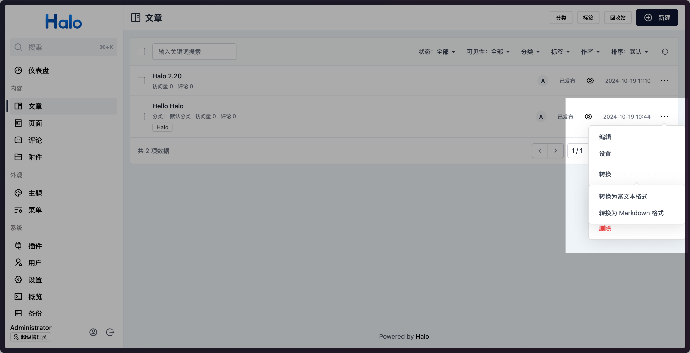
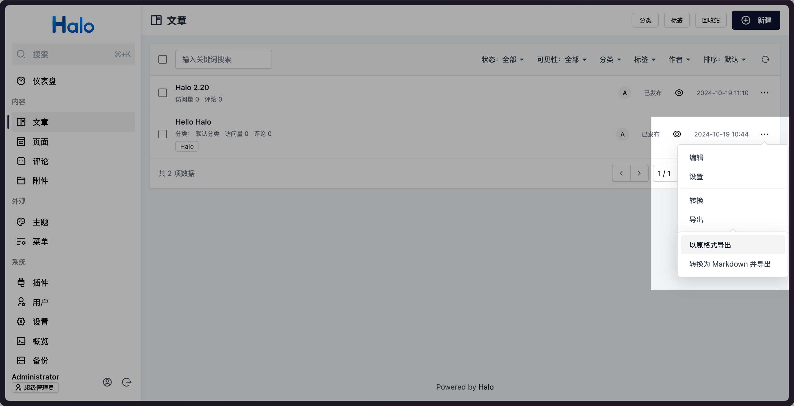
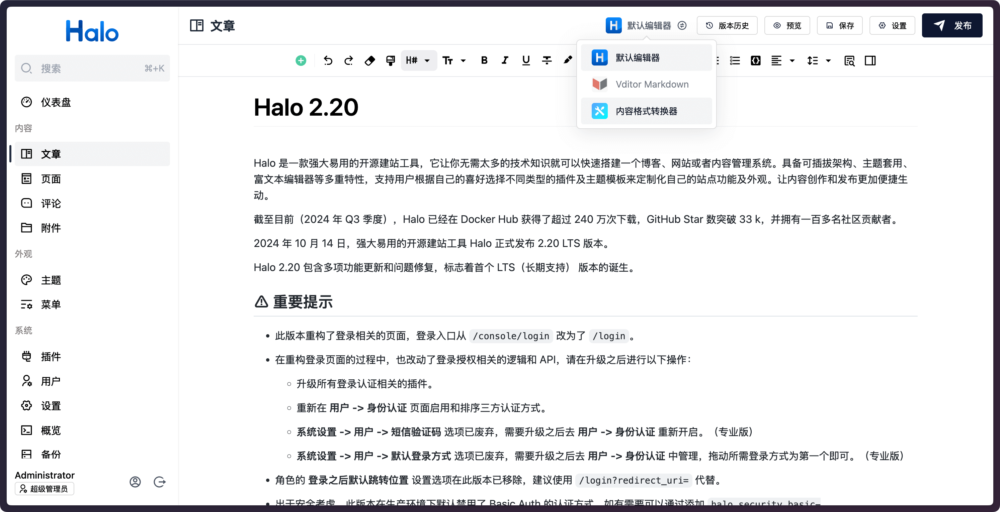
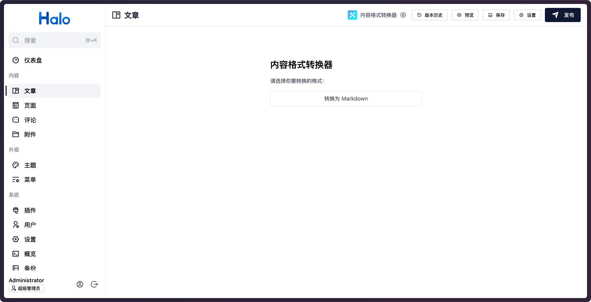
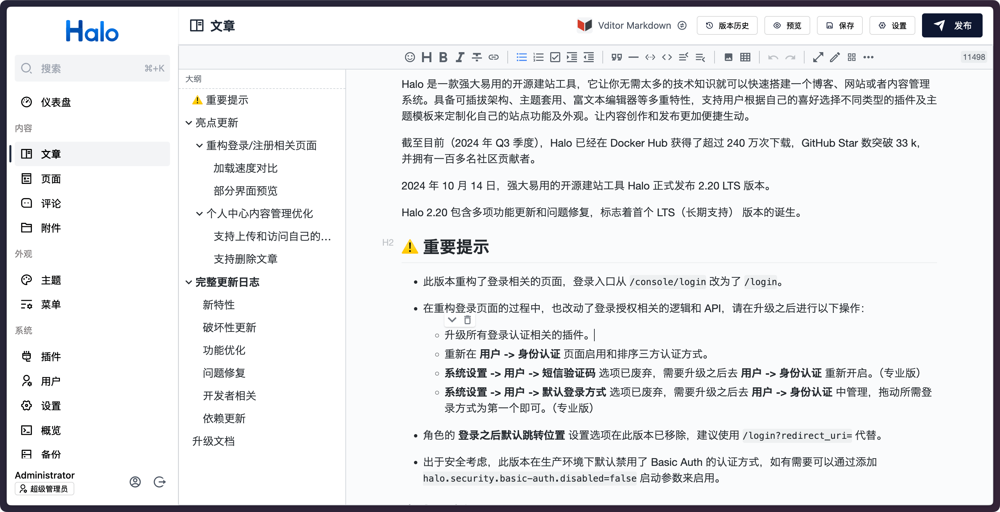
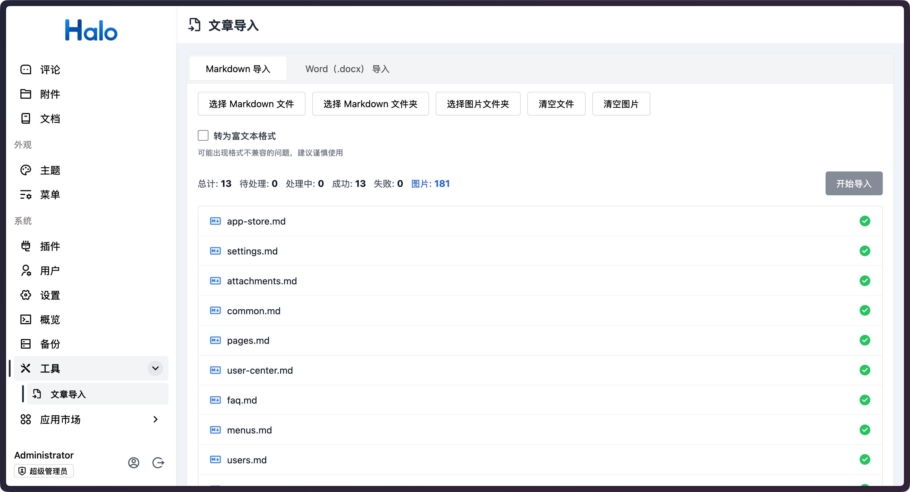
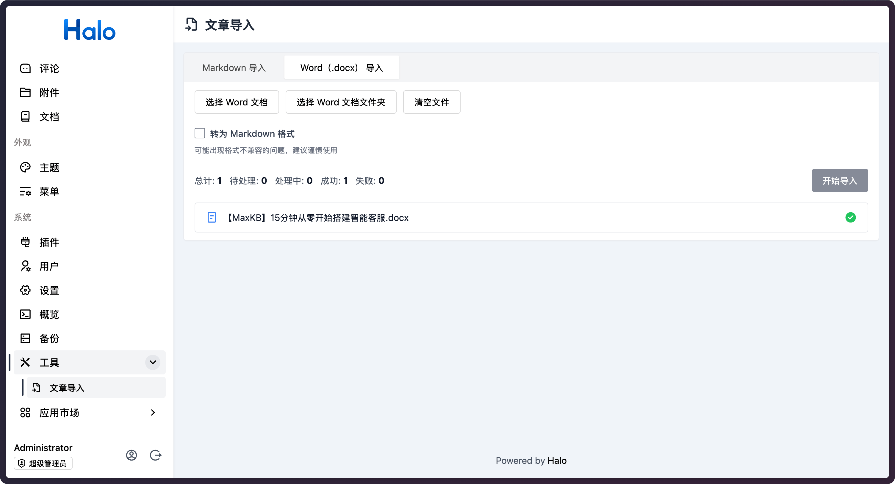

# Halo 内容助手

为 Halo 添加内容格式转换、文章导入导出等功能。

**⚠️ 目前格式转换并不能完全保留原格式，部分语法可能在不同的编辑器中有不同的表现，建议谨慎使用。**

## 特性

- 支持 Markdown 和富文本格式的互转。
- 支持导出文章内容，支持转换为 Markdown 文件导出，支持导出为 PDF。
- 支持 Markdown、Word（.doc、.docx）文档导入，包含关联的图片资源。
- 支持文章克隆。
- 支持复制文章内容。

## 使用方式

1. 下载，目前提供以下两个下载方式：
    - Halo 应用市场：<https://www.halo.run/store/apps/app-SUvBR>
    - GitHub Releases：访问 [Releases](https://github.com/ruibaby/plugin-content-tools/releases) 下载 Assets 中的 JAR 文件。
2. 安装，插件安装和更新方式可参考：<https://docs.halo.run/user-guide/plugins>
3. 在文章管理页面中，点击文章的 `···` 按钮即可看到 **转换** 和 **导出** 的功能选项。
4. 也可以在文章编辑页面顶部的编辑器选择框中选择 **内容格式转换器** 进行转换。

## 预览

